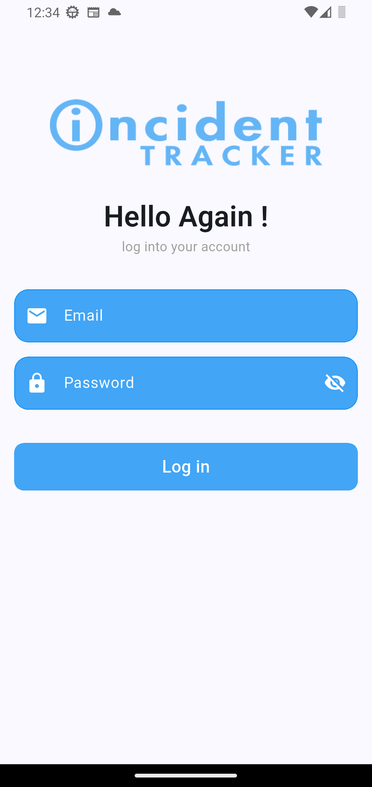
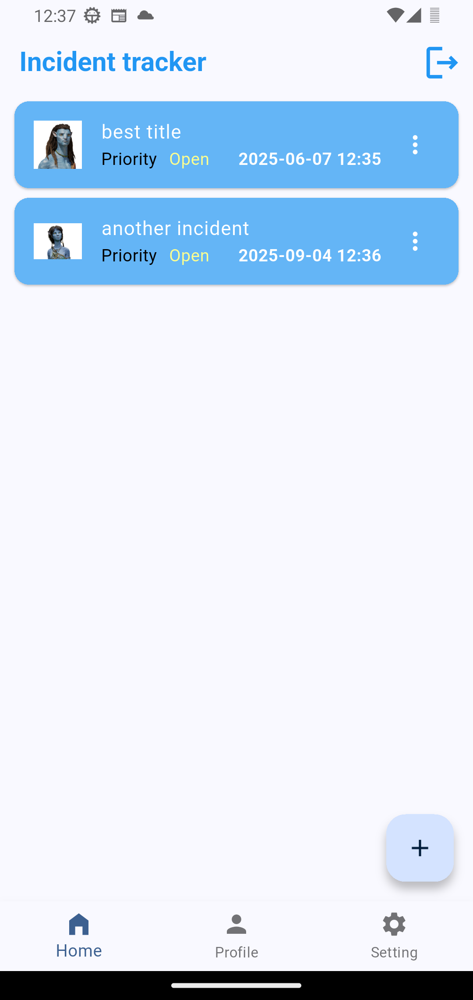
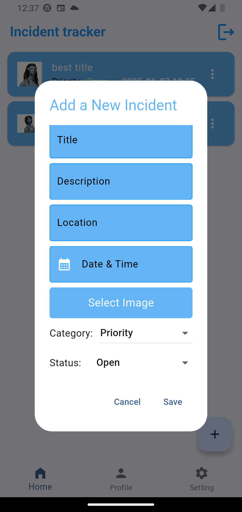
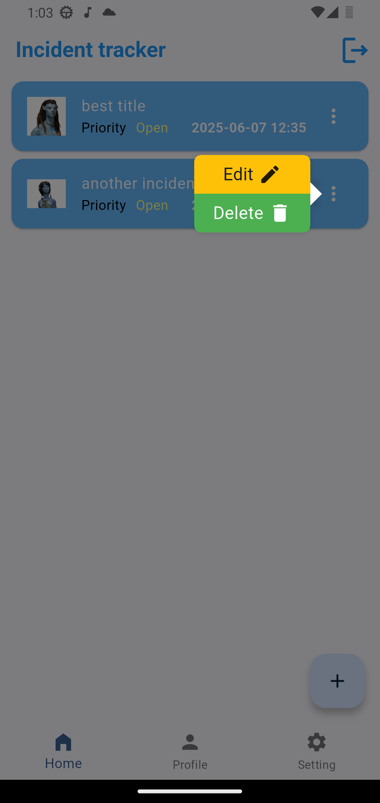
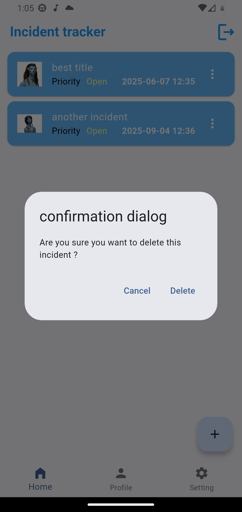
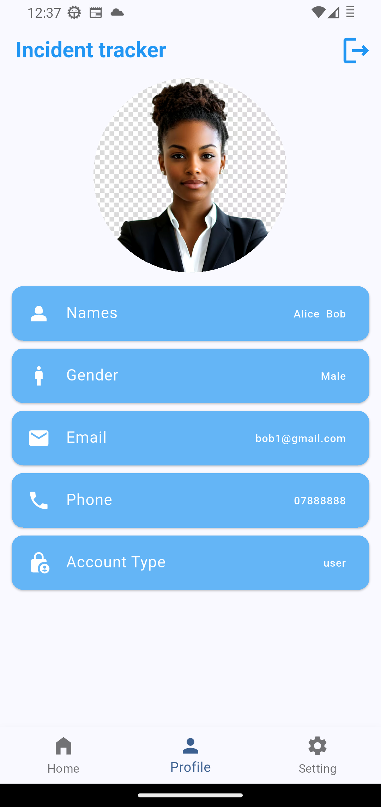

# My Flutter App

This is a Flutter-based mobile application developed as part of an exam assignment. It includes features such as user authentication, profile management, incident reporting, and offline storage.

---

## 📦 APK Download

[Download APK](https://drive.google.com/file/d/1MnDDZzLMQnfCkws03J47PDiG-hG1n-Di/view?usp=sharing)
[Download APK](https://drive.google.com/file/d/1IseeOL8kB4Nb8KuUk4qqf778_EWHZcIN/view?usp=sharing)
[Download APK](https://drive.google.com/file/d/1fJnxJmYMKc1URNWfUj0LvPk5e3VYCmC-/view?usp=sharing)

---

## 📸 Screenshots

| Login Page | Home Screen | Incident Form |
|------------|-------------|----------------|
|  |  |  |

| Incident Card | Delete Confirmation | Profile Page |
|---------------|---------------------|--------------|
|  |  |  |

---

## 🛠 Tools and Packages Used

### 📦 State Management

- **flutter_bloc: ^9.1.1**  
  Used to manage state across the app using the BLoC (Business Logic Component) pattern, making the UI reactive and scalable.

---

### 🗃 Local Storage

- **hive: ^2.2.3**  
- **hive_flutter: ^1.1.0**  
- **hive_generator: ^2.0.1**  
- **build_runner: ^2.4.15**  
  Used together to provide lightweight, NoSQL local database support.  
  - `hive`: Core database package.  
  - `hive_flutter`: Hive integration with Flutter widgets and lifecycle.  
  - `hive_generator` + `build_runner`: For generating TypeAdapters for custom object serialization.

---

### 📨 HTTP Requests

- **dio: ^5.8.0+1**  
  A powerful HTTP client for making REST API calls, handling interceptors, and error management.

---

### 🗂 Data Persistence

- **shared_preferences: ^2.5.3**  
  Stores simple key-value pairs, such as user token or settings, across app launches.

---

### 🔀 Navigation

- **go_router: ^15.1.3**  
  Provides declarative routing for Flutter, simplifying navigation and route guards.

---

### 📦 App Metadata

- **package_info_plus: ^8.3.0**  
  Used to fetch app version and package name information for display or logging.

---

### 🌐 Internationalization

- **intl: ^0.20.2**  
  Formats dates, times, numbers, and messages based on locale for multilingual support.

---

### 📷 Image Handling

- **image_picker: ^1.1.2**  
  Allows users to select images from the gallery or camera for incident reporting or profile picture updates.

---

### ✅ Validation

- **email_validator: ^3.0.0**  
  Validates email input fields to ensure correct formatting.

---

### 🎨 UI Enhancement

- **popover: ^0.3.1**  
  Displays overlay popovers in the app for additional actions or information.

---

### 🔑 UUID Generation

- **uuid: ^4.5.1**  
  Generates unique identifiers for entities like incidents or sessions.

---

### 🚀 App Icon Configuration

- **flutter_launcher_icons: ^0.14.3**  
  Automates the generation of custom app launcher icons for Android and iOS platforms.

---

## 🧑‍💻 Author Declaration

> I confirm that this application was fully developed by me during the exam period. I have not received or used code from others except publicly available resources.

---

